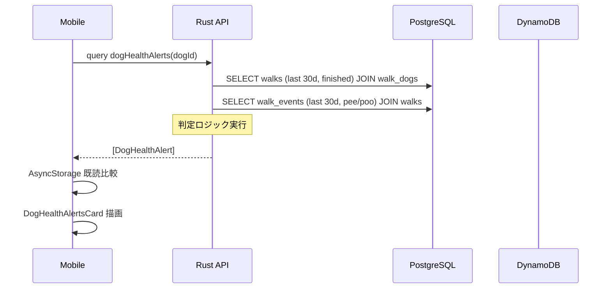

# 散歩ログ分析: 健康アラート機能 v1

## Context

現状、walking-dog は散歩記録（距離・時間・GPS・pee/poo/photo イベント）を蓄積しているが、蓄積データを活用した「犬の健康変化の気づき」が得られていない。飼い主が散歩ログから犬の異変に気づくには、自力でグラフを見比べる必要がある。

この機能は **蓄積データから異常を自動検知して飼い主に通知** し、「犬への貢献心」軸（Product Vision）を強化する。v1 はアプリ内通知に絞り、運用して有効性を検証してから push・閾値設定 UI に拡張する。

## スコープ（v1）

**対象アラート 3 種**（全犬ごとに判定）:

| ID | 名前 | 判定ロジック |
|----|------|------|
| `DISTANCE_DROP` | 散歩量の急減 | 直近 7 日の平均 `distance_m` が直近 30 日（除: 直近7日）平均の **20% 以上減少** |
| `DURATION_DROP` | 散歩時間の急減 | 同上を `duration_sec` で判定 |
| `PACE_DROP` | ペース低下 | `distance_m / duration_sec`（m/s）の直近7日平均が直近30日平均の **15% 以上低下** |
| `ELIMINATION_ANOMALY` | 排泄異常 | 散歩あたりの pee / poo 回数（直近7日 vs 直近30日）が **平均±2σ を外れる** |

**全アラート共通の前提条件**:
- 直近30日のサンプル数 `finished` walks が **8 件以上**（統計的に意味のある比較のため）
- 対象 `status = 'finished'` の walks のみ

**UI**:
- 犬詳細画面（`apps/mobile/app/dogs/[id]/index.tsx`）の `DogStatsCard` 下に `DogHealthAlertsCard` を追加
- アラートありの場合: 黄色（warning）または赤（critical）バッジ + 件数
- タップで展開し、各アラートの説明・該当値・期間を表示
- ボトムタブの犬アイコンに「未読アラートありバッジ」（赤ドット）

**非対象（v2 以降）**:
- 運動不足（連続N日散歩なし）アラート
- push 通知（`expo-notifications` 導入）
- 閾値のユーザー設定
- 犬種・年齢補正
- アラート既読管理のサーバー永続化（v1 はクライアント AsyncStorage）

## アーキテクチャ

### バックエンド（Rust / Axum / async-graphql / SeaORM）

**新規 GraphQL query**:

```graphql
type DogHealthAlert {
  id: String!            # "DISTANCE_DROP" | "DURATION_DROP" | "PACE_DROP" | "ELIMINATION_ANOMALY"
  severity: String!      # "warning" | "critical"
  title: String!         # 日本語表示用（例: "散歩量が減っています"）
  description: String!   # 詳細（例: "直近7日の平均距離が 30日平均より 28% 減少"）
  recentValue: Float!    # 直近7日の値
  baselineValue: Float!  # 直近30日（除直近7日）の値
  deltaPercent: Float!   # (recent - baseline) / baseline * 100
  windowDays: Int!       # 7
  detectedAt: DateTime!  # query 実行時刻
}

extend type Query {
  dogHealthAlerts(dogId: ID!): [DogHealthAlert!]!
}
```

**実装場所**:
- `apps/api/src/graphql/custom_queries.rs` — query 追加
- `apps/api/src/services/health_alert_service.rs` — 新規サービス（判定ロジック）
- `apps/api/src/services/walk_service.rs` — 既存の集計ヘルパー再利用

**判定ロジック（`health_alert_service.rs`）**:

1. `walks` テーブルから対象犬の直近30日 `finished` walk を取得（`walk_dogs` JOIN）
2. サンプル数 < 8 → 空配列を返す（判定不可）
3. 直近7日ウィンドウ / 直近30日ベースライン（除直近7日）で集計
4. 各アラートの閾値と比較し、該当するもののみ返す
5. severity: deltaPercent の絶対値が 30% 以上なら `critical`、それ未満なら `warning`
6. 排泄異常は `walk_events` を JOIN して `event_type IN ('pee', 'poo')` でカウント

**パフォーマンス**:
- 1 回の query あたり 30 日分の walks + events スキャン
- 1 犬 1 日 ~2 walks、30 日 = ~60 行、events ~200 行 → 十分小さい
- 犬詳細画面表示時のみ呼ばれるので N+1 懸念なし

### フロントエンド（React Native / Expo / Apollo）

**新規コンポーネント**:
- `apps/mobile/components/dog/DogHealthAlertsCard.tsx`
  - アラートなし: 「特に異変はありません」（緑チェック）
  - アラートあり: severity ごとに色分けし、タップで各アラート詳細を展開
- `apps/mobile/hooks/useDogHealthAlerts.ts` — Apollo `useQuery` ラッパ

**統合**:
- `apps/mobile/app/dogs/[id]/index.tsx` の `DogStatsCard` 直下に `DogHealthAlertsCard` 配置
- 犬タブアイコン: 自分の全ての犬について alert 件数を合算し、> 0 ならバッジ表示（`apps/mobile/app/(tabs)/_layout.tsx` で `useMyDogs` → 各犬の alerts を合算）

**クライアント既読管理（AsyncStorage）**:
- `dog_alert_read:{dogId}` に最後に開いたタイムスタンプを保存
- `DogHealthAlert.detectedAt > stored_timestamp` なら「未読」扱い
- 犬詳細画面を開くと自動で既読化

## データフロー



**注: DynamoDB (`walk_points`) は v1 では参照しない**（GPS trace はペース計算に不要、`walks.distance_m / duration_sec` で十分）。

## エラーハンドリング

| ケース | 挙動 |
|-------|------|
| サンプル不足（< 8 walks / 30d） | 空配列返却、UI は「データ蓄積中」表示 |
| 対象犬が存在しない / 権限なし | `DogNotFound` / `Forbidden` エラー（既存パターン踏襲） |
| DB エラー | 既存の `AppError` → GraphQL error extension 経由 |
| モバイル: query 失敗 | カード非表示 + 「再試行」ボタン（`refetch`） |

## テスト戦略

**API 単体テスト**（`apps/api/src/services/health_alert_service.rs` に `#[cfg(test)]`）:
- サンプル不足 → 空配列
- 距離30%減 → `DISTANCE_DROP` severity=critical
- 距離15%減 → 空配列（閾値未満）
- pee 回数 +3σ → `ELIMINATION_ANOMALY`
- 排泄データゼロ犬 → 排泄アラート出さない

**API 統合テスト**（`apps/api/tests/test_health_alert.rs` 新規）:
- 既存 test fixture（user/dog/walks 作成）を再利用
- GraphQL query 経由でエンドツーエンド検証
- 他ユーザーの犬へのアクセス拒否

**モバイル単体テスト**（Jest）:
- `DogHealthAlertsCard`: 空・warning・critical 各状態のスナップショット
- `useDogHealthAlerts`: mock Apollo で正常/エラー分岐

**手動検証**:
- iOS Simulator で犬詳細画面を開き、カードが正しく表示されること
- 既存の散歩記録で実データでの表示確認

## 移行/ロールバック

- 新規 query / コンポーネント追加のみ、既存スキーマ変更なし
- DB マイグレーション不要
- クライアント後方互換: 旧クライアントは新 query を呼ばないので影響なし
- ロールバック: コンポーネントのフィーチャーフラグは不要（失敗時は query エラー → カード非表示で自然に無害化）

## 実装順序（TDD）

1. **API: health_alert_service**（赤→緑）
   - 単体テスト先行、判定ロジック実装
2. **API: GraphQL query 配線**
   - 統合テスト先行、`dogHealthAlerts` resolver を実装
3. **Mobile: useDogHealthAlerts hook**
   - Jest mock テスト先行
4. **Mobile: DogHealthAlertsCard**
   - スナップショット + 表示テスト
5. **Mobile: 犬詳細画面統合 + タブバッジ**
   - Simulator 動作確認

## 主要ファイル

**新規**:
- `apps/api/src/services/health_alert_service.rs`
- `apps/api/tests/test_health_alert.rs`
- `apps/mobile/components/dog/DogHealthAlertsCard.tsx`
- `apps/mobile/hooks/useDogHealthAlerts.ts`
- `apps/mobile/components/dog/__tests__/DogHealthAlertsCard.test.tsx`
- `docs/design/health_alerts/DESIGN.md`（仕様書をコミット）

**変更**:
- `apps/api/src/graphql/custom_queries.rs` — query / schema 追加
- `apps/api/src/services/mod.rs` — `health_alert_service` 公開
- `apps/mobile/app/dogs/[id]/index.tsx` — カード統合
- `apps/mobile/app/(tabs)/_layout.tsx` — 犬タブバッジ
- `apps/mobile/gql/*.graphql` — query 定義（codegen 実行）

**再利用**:
- `apps/api/src/services/walk_service.rs` — walks 集計ヘルパー
- `apps/api/src/entities/{walks,walk_dogs,walk_events,dogs}.rs` — SeaORM entities
- `apps/mobile/components/DogStatsCard.tsx` — UI 配置参考

## 検証方法（Verification）

1. **API 単体/統合テスト**: `docker compose exec api cargo test health_alert` で全通過
2. **モバイル単体テスト**: `docker compose exec mobile npm test -- DogHealthAlerts` で全通過
3. **E2E 動作確認**:
   - ローカル API + DynamoDB Local 起動
   - 既存 seed で犬 + 30日分の walks を生成（必要なら test fixture を手動投入スクリプト化）
   - iOS Simulator で犬詳細画面を開き、アラートカードを目視確認
   - 閾値を意図的に越えるデータを投入し、warning / critical 両方の表示を確認
4. **リグレッション**: 既存の `test_walk.rs`, `test_dog.rs` が緑のまま

## 未決事項（後続 PR）

- 排泄標準偏差 σ 計算のサンプル不足時のフォールバック（現状は 8 件必須）
- アラート消失の扱い（例: 翌日復調したら即カード消す or 3日 grace period）
- 運動不足（連続未散歩）アラートは v2 で追加
