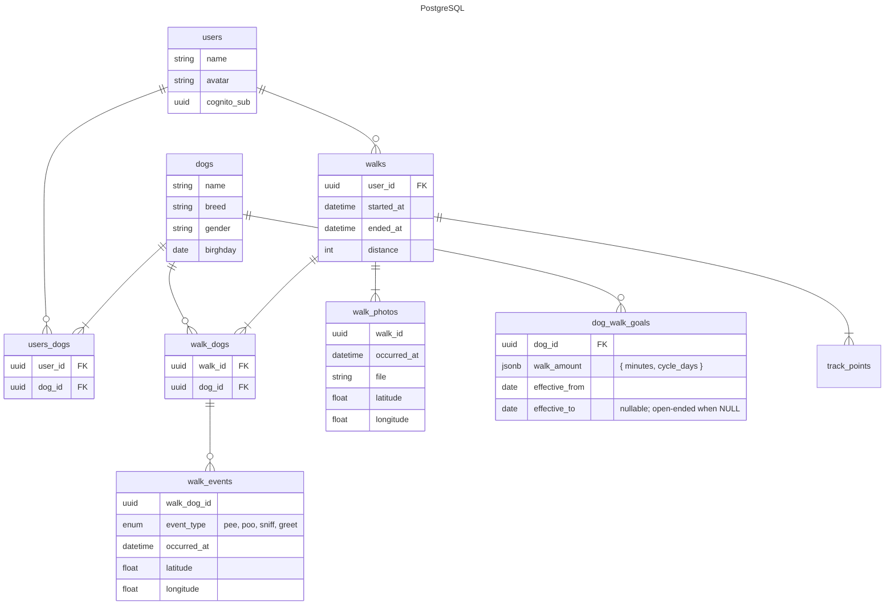
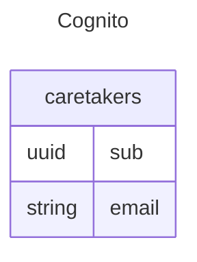
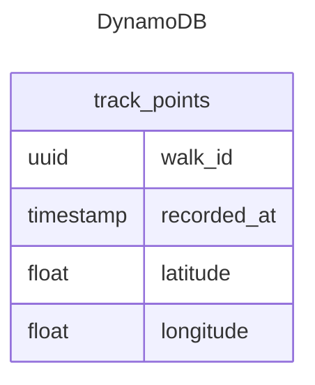

```mermaid
---
title: PostgreSQL
---
erDiagram

users {
    string name
    string avatar
    uuid cognito_sub
}

dogs {
    string name
    string breed
    string gender
    date birghday
}

users_dogs {
    uuid user_id FK
    uuid dog_id FK
}

walks {
    uuid user_id FK
    datetime started_at
    datetime ended_at
    int distance
}

walk_dogs {
    uuid walk_id FK
    uuid dog_id FK
}

walk_photos {
    uuid walk_id
    datetime occurred_at
    string file
    float latitude
    float longitude
}

walk_events {
    uuid walk_dog_id
    enum event_type "pee, poo, sniff, greet"
    datetime occurred_at
    float latitude
    float longitude
}

dog_walk_goals {
    uuid dog_id FK
    jsonb walk_amount "{ minutes, cycle_days }"
    date effective_from
    date effective_to "nullable; open-ended when NULL"
}

users ||--o{ walks : ""
dogs ||--|{ users_dogs : ""
users ||--o{ users_dogs : ""
walks ||--|{ walk_dogs : ""
dogs ||--o{ walk_dogs : ""
walk_dogs ||--o{ walk_events : ""
dogs ||--o{ dog_walk_goals : ""

walks ||--|{ track_points : ""
walks ||--|{ walk_photos : ""

```

```mermaid
---
title: Cognito
---

erDiagram

caretakers {
    uuid sub
    string email
}
```

```mermaid
---
title: DynamoDB
---
erDiagram

track_points {
    uuid walk_id
    timestamp recorded_at
    float latitude
    float longitude
}

```
