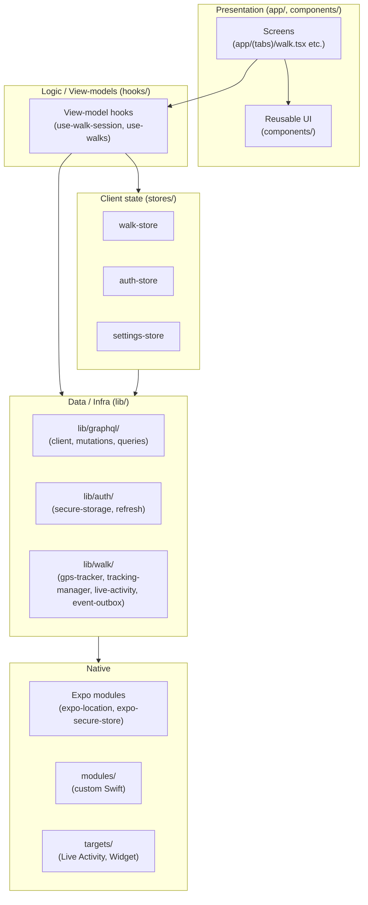
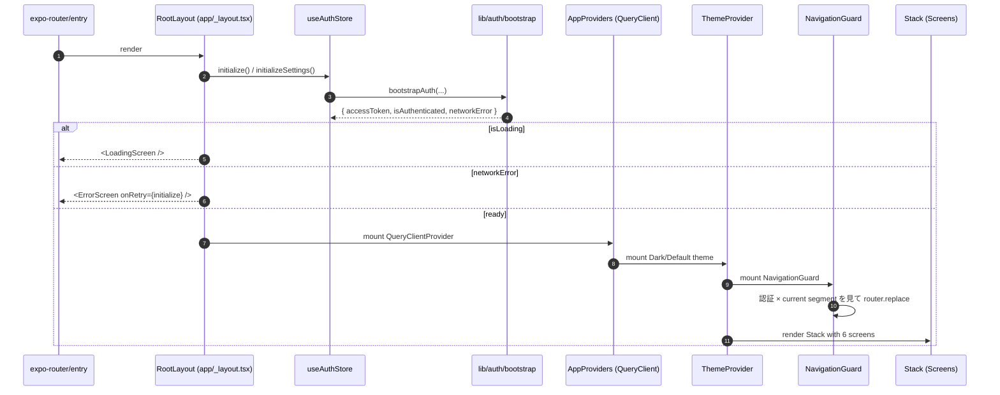
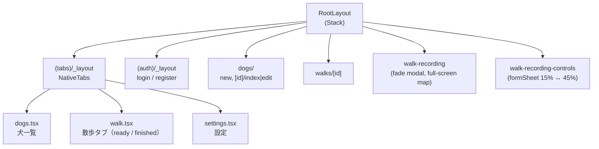
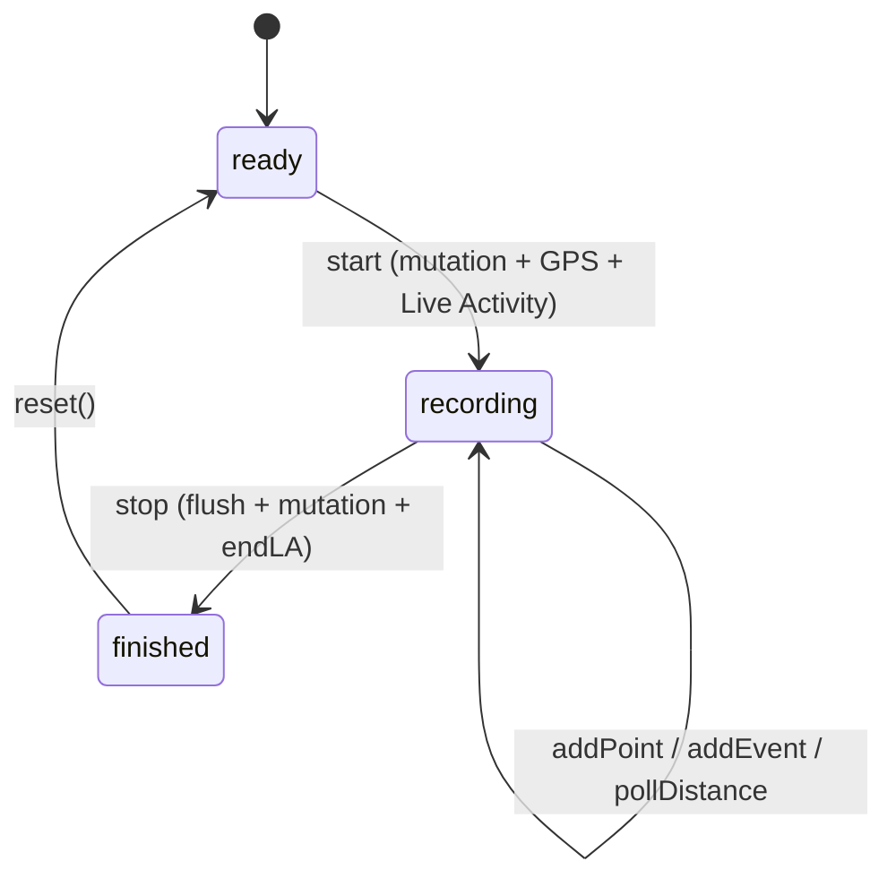
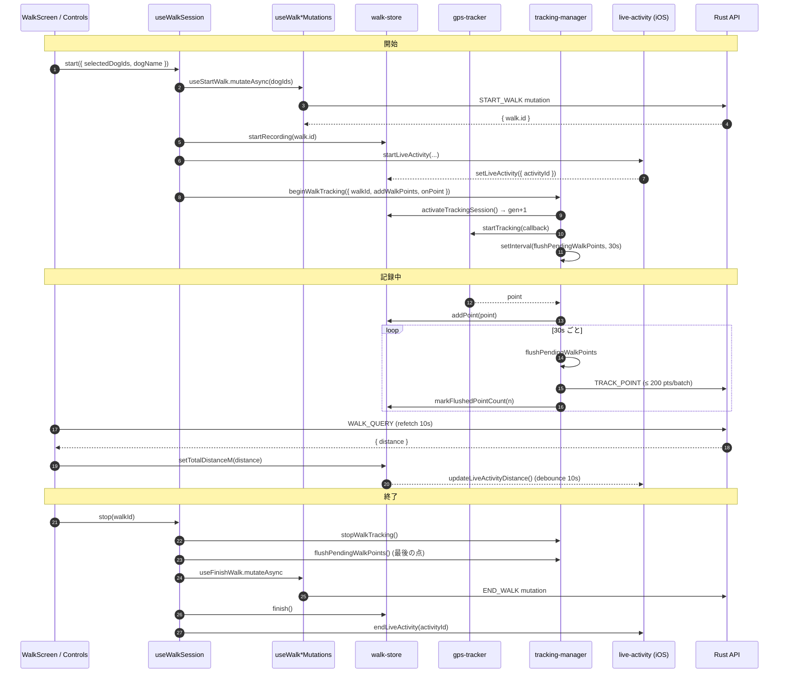
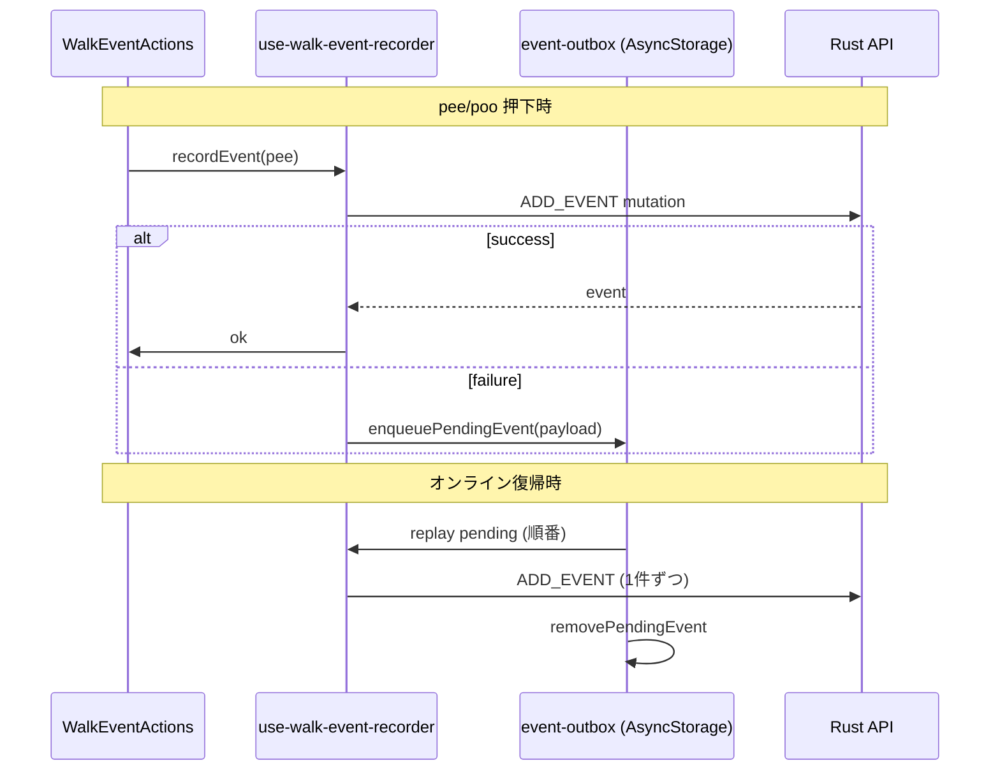

# apps/mobile アーキテクチャ全体像

> **対象 / Audience**: `apps/mobile` に新しく入るジュニアフロントエンドデベロッパー。
> **ゴール / Goal**: 30 分で森を見て、30 分で起動の幹を辿り、60〜90 分で散歩記録の枝を最後まで読む。
> **読み方 / How to use**: 章 2 → 3 → 4 の順に進む。各章は「全体図 → 表 → コードへのリンク → 設計判断の意図」で構成。

---

## 1. 技術スタック早見表

この章で学ぶこと： **どんな部品で組まれているか** を 1 枚で把握する。

| 層 / Layer | 採用ライブラリ | 役割 |
|---|---|---|
| Framework | Expo SDK 55 / React Native 0.83 / React 19 | RN ランタイム & ネイティブ依存の管理（managed workflow） |
| Language | TypeScript 5.9 (strict) | 型安全 |
| Routing | `expo-router` v5（file-based）+ `unstable-native-tabs` | `app/` ツリーがそのままルートツリー |
| Client state | `zustand` | UI 状態・セッション状態（auth / walk / settings） |
| Server state | `@tanstack/react-query` | API キャッシュ・ポーリング・楽観的更新 |
| GraphQL client | `graffle` + `graphql` | GraphQL リクエスト送信 |
| Secure storage | `expo-secure-store` | 認証トークン |
| Maps / GPS | `react-native-maps` + `expo-location` | 地図描画 / 位置情報 |
| Native UI bridge | `@expo/ui`, `expo-blur`, `expo-symbols` | iOS ネイティブの形をそのまま使う |
| iOS targets | `@bacons/apple-targets` | Live Activity / Widget extension |
| i18n | `i18next` + `react-i18next` | 翻訳 |
| Animations | `react-native-reanimated` v4 + `react-native-worklets` | UI thread 上のアニメーション |
| Test | `jest-expo` + `@testing-library/react-native` | Unit / component test |

> 📦 完全な依存リスト: [apps/mobile/package.json](../../apps/mobile/package.json)

---

## 2. ディレクトリマップ ★ Method 1: 森を見る

この章で学ぶこと： **どこに何があるか** を責務単位で覚える。

### 2-1. ディレクトリ責務表

| ディレクトリ | 責務 | 代表ファイル |
|---|---|---|
| [`app/`](../../apps/mobile/app/) | **Presentation (routes)** — Expo Router のファイルベースルート。`_layout.tsx` がナビ、`*.tsx` が画面 | [_layout.tsx](../../apps/mobile/app/_layout.tsx), [(tabs)/walk.tsx](../../apps/mobile/app/(tabs)/walk.tsx) |
| [`components/`](../../apps/mobile/components/) | **再利用 UI** — 画面間で共有される View / Button / Map など | [WalkMap.tsx](../../apps/mobile/components/walk/WalkMap.tsx) |
| [`hooks/`](../../apps/mobile/hooks/) | **ロジック再利用** — view-model / mutation / 色テーマ etc. | [use-walk-session.ts](../../apps/mobile/hooks/use-walk-session.ts) |
| [`stores/`](../../apps/mobile/stores/) | **Client state (Zustand)** — auth / walk / settings の 3 ストア | [walk-store.ts](../../apps/mobile/stores/walk-store.ts) |
| [`lib/`](../../apps/mobile/lib/) | **インフラ / 純粋ロジック** — GraphQL client, 認証, GPS, i18n, storage | [graphql/client.ts](../../apps/mobile/lib/graphql/client.ts), [walk/tracking-manager.ts](../../apps/mobile/lib/walk/tracking-manager.ts) |
| [`theme/`](../../apps/mobile/theme/) | **デザイントークン** — colors / spacing / typography / components | [tokens.ts](../../apps/mobile/theme/tokens.ts) |
| [`modules/`](../../apps/mobile/modules/) | **Expo ネイティブモジュール** — Swift / Kotlin で書いた拡張 | （Live Activity 等） |
| [`targets/`](../../apps/mobile/targets/) | **iOS 拡張ターゲット** — `@bacons/apple-targets` 経由の Widget / Live Activity | |
| [`types/`](../../apps/mobile/types/) | **共有 TS 型** — GraphQL スキーマから派生した型 | |
| [`constants/`](../../apps/mobile/constants/) | **マジック値の定数集約** | |
| [`__tests__/`](../../apps/mobile/__tests__/) | **トップレベルテスト** — 横断テスト（各ディレクトリ内 `*.test.ts` と併存） | |

### 2-2. レイヤー図

### 2-3. ジュニアが見落としがちなポイント

| 観察 | 意図 |
|---|---|
| `stores/` と `lib/` が分かれている | **状態（変わる）と純粋ロジック（変わらない）を分離**。tracking-manager は副作用を持つが、ストアの中ではなくモジュール変数として保持されている |
| `lib/walk/` がフォルダ単位で存在 | 散歩機能は GPS / 距離 / Outbox / Live Activity と部品が多いので独立ディレクトリで凝集を作る |
| `theme/` 配下に `tokens.ts` + `overrides.ts` | **トークン使用が原則**、例外的な値（splash 色、native stack header tint）だけ `overrides.ts` に named constant で隔離（[apps/mobile/CLAUDE.md](../../apps/mobile/CLAUDE.md) 参照） |

---

## 3. 起動シーケンス ★ Method 2: 幹を辿る

この章で学ぶこと： **アプリ起動から最初の画面が出るまで何が走るか**。

### 3-1. ブート図

### 3-2. Provider スタック（外→内）

| # | 層 | 出所 | 役割 |
|---|---|---|---|
| 1 | `<LoadingScreen>` / `<ErrorScreen>` | [app/_layout.tsx:69](../../apps/mobile/app/_layout.tsx) | 認証 bootstrap 中の guard |
| 2 | `<AppProviders>` = `QueryClientProvider` | [lib/providers.tsx](../../apps/mobile/lib/providers.tsx) | TanStack Query。**401 を受けたら `useAuthStore.clearAuth()` で自動ログアウト** |
| 3 | `<ThemeProvider>` | [app/_layout.tsx:79](../../apps/mobile/app/_layout.tsx) | Dark / Light を `useColorScheme` で切替 |
| 4 | `<NavigationGuard>` | [app/_layout.tsx:22](../../apps/mobile/app/_layout.tsx) | `isAuthenticated` × `segments[0]` で `/(auth)/login` か `/(tabs)/walk` へ redirect |
| 5 | `<Stack>` | [app/_layout.tsx:81](../../apps/mobile/app/_layout.tsx) | 6 screens: `(tabs)`, `(auth)`, `dogs`, `walks`, `walk-recording`, `walk-recording-controls` |

### 3-3. ルートツリー

### 3-4. 認証フロー（NavigationGuard）

| 条件 | 行き先 |
|---|---|
| `isLoading === true` | `<LoadingScreen />`（Guard は何もしない） |
| `networkError === true` | `<ErrorScreen onRetry={initialize} />` |
| `!isAuthenticated && !inAuthGroup` | `router.replace('/(auth)/login')` |
| `isAuthenticated && inAuthGroup` | `router.replace('/(tabs)/walk')` |

> 📐 認証は **Rust API 経由のみ**（モバイルから Cognito に直接通信しない）。`lib/auth/api.ts` の `refreshToken` がリフレッシュを担う。
> 401 自動ログアウトの実装位置は `lib/providers.tsx` の `QueryCache.onError` / `MutationCache.onError`。

---

## 4. 縦切り walkthrough：散歩記録 ★ Method 3: 1 本の枝を最後まで

この章で学ぶこと： **1 機能を画面→hook→store→GraphQL→ネイティブまで縦に追って、典型パターンを体得する**。

### 4-1. 状態遷移

`phase` の遷移は [stores/walk-store.ts](../../apps/mobile/stores/walk-store.ts) の `startRecording` / `finish` / `reset` でのみ起きる。

### 4-2. レイヤー別代表ファイル

| Layer | File | 役割 |
|---|---|---|
| UI – Ready | [app/(tabs)/walk.tsx](../../apps/mobile/app/(tabs)/walk.tsx) | `phase === 'ready' / 'finished'` の分岐 |
| UI – Ready view | [components/walk/WalkReadyView.tsx](../../apps/mobile/components/walk/WalkReadyView.tsx) | 犬選択 + 開始ボタン |
| UI – Recording | [app/walk-recording.tsx](../../apps/mobile/app/walk-recording.tsx) | 全画面マップ + 10 秒ごとに distance ポーリング |
| UI – Controls | [app/walk-recording-controls.tsx](../../apps/mobile/app/walk-recording-controls.tsx) | formSheet。pee/poo/photo/stop ボタン |
| UI – Map | [components/walk/WalkMap.tsx](../../apps/mobile/components/walk/WalkMap.tsx) | polyline + マーカー描画 |
| Session orchestration | [hooks/use-walk-session.ts](../../apps/mobile/hooks/use-walk-session.ts) | `start()` / `stop()` を 1 つにまとめる |
| Walk fetch | [hooks/use-walks.ts](../../apps/mobile/hooks/use-walks.ts) | `useWalk(id, { refetchIntervalMs })` |
| Mutations | [hooks/use-walk-mutations.ts](../../apps/mobile/hooks/use-walk-mutations.ts) | `useStartWalk` / `useFinishWalk` / `useAddWalkPoints` |
| Event mutation | [hooks/use-walk-event-mutations.ts](../../apps/mobile/hooks/use-walk-event-mutations.ts) | `useRecordWalkEvent` (pee/poo) |
| Outbox flush | [hooks/use-flush-walk-event-outbox.ts](../../apps/mobile/hooks/use-flush-walk-event-outbox.ts) | オフライン→復旧時の再送 |
| State | [stores/walk-store.ts](../../apps/mobile/stores/walk-store.ts) | `phase` / `points` / `flushedPointCount` / `trackingGeneration` / `liveActivity` |
| GraphQL queries | [lib/graphql/queries/walk.ts](../../apps/mobile/lib/graphql/queries/walk.ts) | `WALK_QUERY` |
| GraphQL mutations | [lib/graphql/mutations/walk.ts](../../apps/mobile/lib/graphql/mutations/walk.ts) | `startWalk` / `endWalk` / `trackPoint` / `addEvent` / `takePhoto` |
| GPS | [lib/walk/gps-tracker.ts](../../apps/mobile/lib/walk/gps-tracker.ts) | `expo-location.watchPositionAsync` をラップ（前景専用） |
| Tracking manager | [lib/walk/tracking-manager.ts](../../apps/mobile/lib/walk/tracking-manager.ts) | バッチ送信 + 並行フラッシュ制御 |
| Live Activity | [lib/walk/live-activity.ts](../../apps/mobile/lib/walk/live-activity.ts) | iOS Live Activity 起動/更新/終了 |
| Persistence | [lib/walk/event-outbox.ts](../../apps/mobile/lib/walk/event-outbox.ts) | pee/poo を AsyncStorage に outbox 保存 |

### 4-3. データフロー（開始 → 記録 → 終了）

### 4-4. オフライン復旧フロー（pee/poo イベント）

### 4-5. 設計パターン解説

| パターン | 何を防ぐか | 実装の場所 |
|---|---|---|
| **Distance はサーバー真実** — クライアントは GPS 点を保持するだけ、距離はサーバ側 Haversine 累積を 10 秒ポーリングで取り込む | 端末ごとに距離がズレる／複数家族で見た時の不整合 | コメントは [walk-store.ts:91-92](../../apps/mobile/stores/walk-store.ts) と [use-walk-session.ts:60-63](../../apps/mobile/hooks/use-walk-session.ts) |
| **`flushedPointCount`** — 送信済み点数を保存し、未送信分だけ切り出して送る | 同じ点の二重送信。中途で増えた点も次回バッチで拾える | `walk-store.ts` の `markFlushedPointCount`、`tracking-manager.ts` の `flushPendingWalkPointsNow` |
| **`trackingGeneration`** — GPS リスナー世代番号。stop→再 start で +1 し、古い callback は無視 | 「停止したはずの listener から古い点が降ってくる」race | `walk-store.ts` の `activateTrackingSession` / `attachTrackingCleanup` |
| **並行フラッシュコアレッシング** — `activeFlushPromise` 実行中の追加リクエストは `queuedFlushRequest` 1 件に畳む | 並行 mutation で順序が乱れる / レスポンス重複 | [tracking-manager.ts:104-129](../../apps/mobile/lib/walk/tracking-manager.ts) |
| **バッチ上限 200 点** — サーバ側 request サイズ上限に合わせる | 413 / バリデーション拒否 | [tracking-manager.ts:7](../../apps/mobile/lib/walk/tracking-manager.ts) |
| **Live Activity デバウンス（10 秒）** — `liveActivity.lastUpdateAt` で間引き | ネイティブ呼び出しの過剰実行 | `walk-store.ts` の `bumpLiveActivityUpdateAt`、呼び出し側で 10 秒 gate |
| **Event Outbox（pee/poo のみ）** — photo は volatile URI なので outbox に入れない | オフライン時のイベント喪失。photo は URI が消えるので別経路 | [lib/walk/event-outbox.ts](../../apps/mobile/lib/walk/event-outbox.ts) |
| **401 で自動ログアウト** — QueryCache / MutationCache の onError で `useAuthStore.clearAuth()` | 期限切れトークンで永久にエラー画面が出続ける | [lib/providers.tsx:10-24](../../apps/mobile/lib/providers.tsx) |

---

## 5. 暗黙のコーディングルール（必読）

この章で学ぶこと： **書く前に知っておくと指摘されない暗黙ルール**。出典は [apps/mobile/CLAUDE.md](../../apps/mobile/CLAUDE.md) と [apps/mobile/.claude/rules/](../../apps/mobile/.claude/rules/)。

| ルール | 守らないと | 詳細 |
|---|---|---|
| **スタイルは `theme/tokens.ts` のトークンを使う** — `padding: 16` 等の magic number 禁止。値が無ければ tokens.ts に追加してから使う | `feedback_mobile_use_tokens` 違反 | `colors[scheme].*`, `spacing.*`, `radius.*`, `typography.*`, `elevation.*`, `components.*` |
| **認証は Rust API 経由のみ** — モバイルから Cognito 直接呼び出し禁止 | `feedback_auth_via_api` 違反 | refresh は `lib/auth/api.ts` の `refreshToken` 経由 |
| **Sensitive token は `expo-secure-store`** — AsyncStorage に保存しない | セキュリティ事故 | 既存パターンは `lib/auth/secure-storage.ts` |
| **Functional components + named export only** — default export 禁止（`app/` の screen のみ Expo Router の制約で default export が必要） | lint error | `export const Foo = () => ...` |
| **エラーを隠さない** — fetch エラーで empty state を出さない。`useQuery` の `.error` を画面に通す | `feedback_no_error_hiding` 違反 | `__DEV__` では `error.message` も表示 |
| **Expo 公式 SDK を優先** — community 製は native API が不足するときの最終手段 | inconsistent stack | `expo-image` > `react-native-fast-image` 等 |
| **Conventional Commits** — `feat:` / `fix:` / `refactor:` / ... | PR タイトル / CI チェック | |
| **`(group)` segment 単独で navigate しない** — `router.push('/(tabs)')` は Unmatched | typed-routes lint error | `/(tabs)/walk` のように具体ルートで |

---

## 6. 次に読むべきもの

| やりたいこと | 読む順 |
|---|---|
| **散歩記録に機能を足す** | 4-2 の表 → `hooks/use-walk-session.ts` → 関連する mutation を追加 → `tracking-manager.ts` 側で必要なら batching を調整 |
| **新しい画面を足す** | [apps/mobile/.claude/rules/common/navigation.md](../../apps/mobile/.claude/rules/common/navigation.md) → 既存の `app/(tabs)/*` を真似て新ルートを作る |
| **デザインシステムを拡張** | [docs/design/](../design/) → `theme/tokens.ts` にトークン追加 → `components/` を更新 |
| **認証フローを変更** | `stores/auth-store.ts` → `lib/auth/bootstrap.ts` → `lib/auth/api.ts`（API 経由は必須） |
| **GraphQL を増やす** | `lib/graphql/queries/` or `mutations/` に追加 → `hooks/use-*` でラップ → query key を `lib/graphql/keys.ts` に登録 |
| **ネイティブ機能を足す** | [apps/mobile/.claude/rules/expo/patterns.md](../../apps/mobile/.claude/rules/expo/patterns.md) → `modules/` か `targets/` 配下に追加 |

### 関連ドキュメント

- 開発ルール総合: [apps/mobile/CLAUDE.md](../../apps/mobile/CLAUDE.md)
- プロジェクト全体ビジョン: [walking-dog/CLAUDE.md](../../CLAUDE.md)
- バックエンド API: [apps/api/README.md](../../apps/api/README.md), GraphQL schema: [apps/api/schema.graphql](../../apps/api/schema.graphql)
