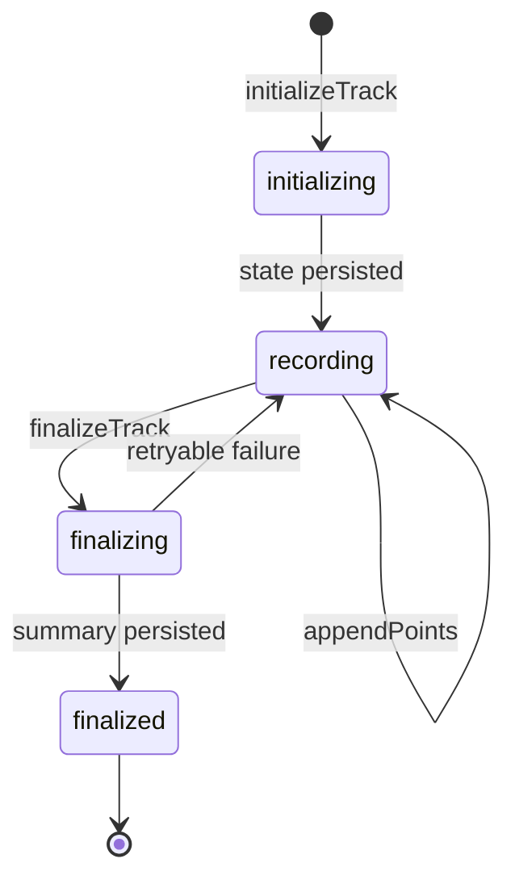

# Track Recording State Machine

```mermaid
stateDiagram-v2
    [*] --> initializing: initializeTrack
    initializing --> recording: state persisted
    recording --> recording: appendPoints
    recording --> finalizing: finalizeTrack
    finalizing --> finalized: summary persisted
    finalizing --> recording: retryable failure
    finalized --> [*]
```

finalized後のpoint追加は拒否します。同じfinalize requestは既存summaryを返します。summaryの再計算が必要なalgorithm変更は既存versionを上書きせず、明示的なrebuild operationで新versionを作ります。
