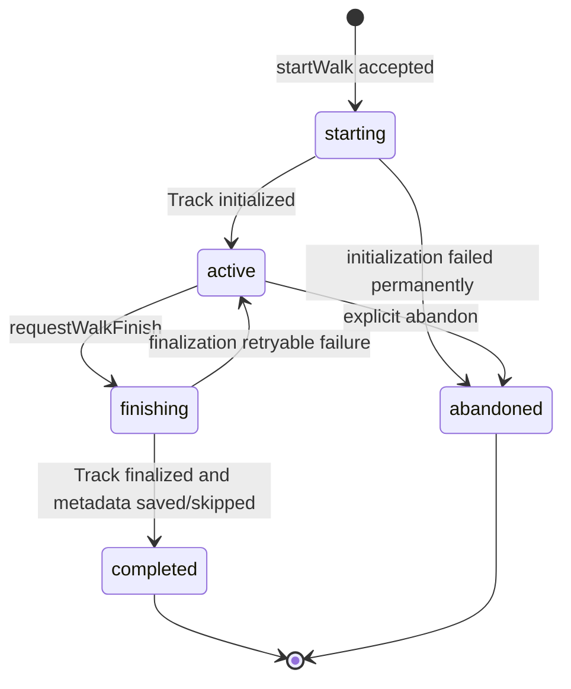

# Walk Session State Machines

## Recovery

`starting`、`active`、`finishing`はサーバー上の正本です。アプリ起動時に`currentWalk`を問い合わせ、ローカル状態より優先します。`starting`は初期化を再試行し、`active`は記録を再開し、`finishing`はTrack確定または終了情報入力を再開します。

## Terminal Rules

`completed`と`abandoned`から状態を戻しません。訂正機能を将来追加する場合も、新しいrevisionとして別契約で表現します。
